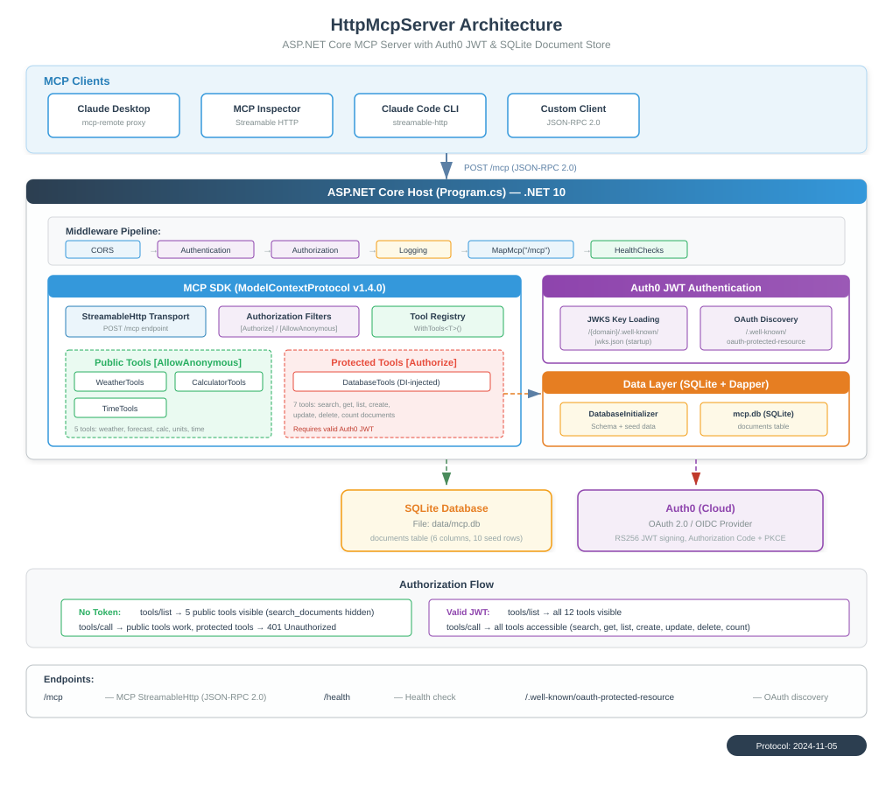

# HttpMcpServer

ASP.NET Core MCP (Model Context Protocol) 服务器 — 通过 StreamableHttp 传输协议暴露 AI 工具调用能力，使用 Auth0 JWT 保护敏感工具，支持 MCP OAuth 自动发现。

An ASP.NET Core MCP server with Auth0 JWT selective tool authorization and MCP OAuth auto-discovery.



## Tech Stack

| Technology | Version | Purpose |
|---|---|---|
| .NET | 10.0 | Runtime |
| ASP.NET Core | 10.0 | Web host & middleware |
| ModelContextProtocol | 1.4.0 | MCP SDK (core types) |
| ModelContextProtocol.AspNetCore | 1.4.0 | MCP HTTP transport + auth filters |
| Microsoft.AspNetCore.Authentication.JwtBearer | 10.x | JWT Bearer authentication |
| Auth0 | — | OAuth 2.0 / OIDC identity provider |

## Modules

| Module | File | Auth | Responsibility |
|---|---|---|---|
| Host | `Program.cs` | — | Auth0 JWT + JWKS, MCP server DI, OAuth metadata, middleware |
| WeatherTools | `Tools/WeatherTools.cs` | Public | Simulated weather data |
| CalculatorTools | `Tools/CalculatorTools.cs` | Public | Math evaluation, unit conversion |
| TimeTools | `Tools/TimeTools.cs` | Public | Timezone-aware time queries |
| DatabaseTools | `Tools/DatabaseTools.cs` | **JWT Required** | Document search (DI-injected) |

## Authorization Model

MCP SDK `AddAuthorizationFilters()` provides per-tool access control:

| Attribute | Behavior |
|---|---|
| `[AllowAnonymous]` | Tool visible and callable without authentication |
| `[Authorize]` | Tool **hidden** from `tools/list` and **blocked** on call without valid JWT |

```
No Token:              tools/list → get_weather, get_forecast, calculate,
                                   convert_units, get_current_time, list_timezones
                       (search_documents is hidden)

With valid JWT:        tools/list → all 7 tools available
```

## OAuth Auto-Discovery

The server exposes `/.well-known/oauth-protected-resource` for MCP-native OAuth flow:

```
1. MCP client connects → receives 401
2. Discovers /.well-known/oauth-protected-resource
3. Finds Auth0 as authorization server
4. Initiates Authorization Code flow with PKCE
5. User logs in via Auth0
6. Client receives access token
7. Subsequent requests include Bearer token
```

## Quick Start

```bash
# Restore and build
dotnet build HttpMcpServer/HttpMcpServer.csproj

# Run (defaults to http://localhost:5000)
dotnet run --project HttpMcpServer/HttpMcpServer.csproj
```

## Configuration

Update `appsettings.json` with your Auth0 settings:

```json
{
  "Auth0": {
    "Domain": "your-tenant.us.auth0.com",
    "Audience": "https://your-api-identifier"
  }
}
```

### Auth0 Setup

1. **Auth0 Dashboard → Applications → APIs → Create API** (sets Audience, RS256 signing)
2. **Auth0 Dashboard → Applications → Applications → Create Application**
   - Type: Machine to Machine (for testing) or Native (for OAuth flow)
   - Authorize the API
3. **For OAuth auto-discovery**: Add `http://localhost:6274/oauth/callback` to Allowed Callback URLs

### Get a test token

```bash
curl --request POST \
  --url https://your-tenant.us.auth0.com/oauth/token \
  --header 'content-type: application/json' \
  --data '{
    "client_id": "<client-id>",
    "client_secret": "<client-secret>",
    "audience": "https://your-api-identifier",
    "grant_type": "client_credentials"
  }'
```

## API Endpoints

| Endpoint | Auth | Description |
|---|---|---|
| `/mcp` | Per-tool | MCP StreamableHttp endpoint (JSON-RPC 2.0) |
| `/health` | None | Health check |
| `/.well-known/oauth-protected-resource` | None | OAuth resource metadata for auto-discovery |

## MCP Tools

| Tool | Auth | Parameters | Description |
|---|---|---|---|
| `get_weather` | Public | `city`, `units?` | Get current weather |
| `get_forecast` | Public | `city` | Get 3-day forecast |
| `calculate` | Public | `expression` | Evaluate math expression |
| `convert_units` | Public | `value`, `from`, `to` | Unit conversion |
| `get_current_time` | Public | `timezone?` | Get time for timezone |
| `list_timezones` | Public | `search?` | List available timezones |
| `search_documents` | **JWT** | `query`, `limit?` | Search document database |

## Client Configuration

### MCP Inspector

1. Transport: `Streamable HTTP`
2. URL: `http://localhost:5000/mcp`
3. For protected tools: Add header `Authorization: Bearer <token>`

### Claude Desktop (via mcp-remote)

```json
{
  "mcpServers": {
    "http-tools-server": {
      "command": "npx",
      "args": ["-y", "mcp-remote", "http://localhost:5000/mcp"]
    }
  }
}
```

### Claude Code CLI

```bash
claude mcp add http-tools-server --transport streamable-http http://localhost:5000/mcp
```

## Example Request

```bash
# Public tool - no token needed
curl -X POST http://localhost:5000/mcp \
  -H "Content-Type: application/json" \
  -d '{
    "jsonrpc": "2.0", "id": "1",
    "method": "tools/call",
    "params": { "name": "get_weather", "arguments": { "city": "Shanghai" } }
  }'

# Protected tool - token required
curl -X POST http://localhost:5000/mcp \
  -H "Content-Type: application/json" \
  -H "Authorization: Bearer <your-access-token>" \
  -d '{
    "jsonrpc": "2.0", "id": "2",
    "method": "tools/call",
    "params": { "name": "search_documents", "arguments": { "query": "MCP protocol" } }
  }'
```
